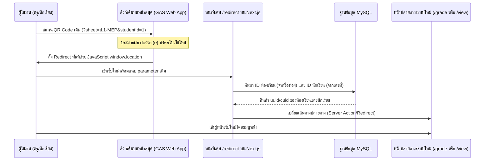

# แนวทางการเชื่อมโยง QR Code เดิม (GAS) เข้าสู่เซิร์ฟเวอร์ใหม่ (Next.js)
> **เอกสารสำหรับใช้อ้างอิงการประชุมและเตรียมตัวเขียนโค้ด (QR Redirector Bridge)**

เทรนเนอร์ต้องการเปลี่ยนผ่านระบบจาก Google Apps Script (GAS) เดิมไปยัง Next.js ที่ติดตั้งบนเซิร์ฟเวอร์ใหม่ โดย**ไม่ต้องเปลี่ยนรูปภาพ QR Code** ที่เคยพิมพ์แปะบนสมุดของนักเรียนไว้แล้ว (เพื่อประหยัดแรงและต้นทุนกระดาษพิมพ์) 

---

## 1. แผนผังการทำงาน (Architecture Flow)



---

## 2. ขั้นตอนการดำเนินการ (Implementation Steps)

### ขั้นตอนที่ 1: แก้ไขสคริปต์บนระบบ GAS เดิม
แก้ไขฟังก์ชัน `doGet(e)` ในสคริปต์หลักของ Google Apps Script (`รหัส.js`) ให้เปลี่ยนหน้าที่จากการแสดงผลหน้าเว็บเดิม เป็นหน้าเว็บที่ส่งต่อข้อมูล (Redirect) ไปเซิร์ฟเวอร์ใหม่โดยทันที:

```javascript
function doGet(e) {
  const params = (e && e.parameter) ? e.parameter : {};
  const sheet = params.sheet || '';
  const studentId = params.studentId || ''; // ในระบบเดิมคือ "เลขที่"
  const mode = params.mode || ''; // 'grade' สำหรับโหมดตรวจงาน หรือค่าว่างสำหรับดูคะแนน
  
  // URL โดเมนของเซิร์ฟเวอร์ใหม่ (ปรับเปลี่ยนตามชื่อโดเมนจริงตอน Deploy)
  const NEW_SERVER = 'https://homework.thatnarai.net'; 
  
  let targetUrl = NEW_SERVER;
  
  if (sheet && studentId) {
    // ส่งต่อห้องและเลขที่ไปยังหน้าตัวกลางบน Next.js เพื่อนำไปค้นหารหัสจริงใน MySQL
    targetUrl = NEW_SERVER + '/redirect?mode=' + encodeURIComponent(mode) + 
                '&roomName=' + encodeURIComponent(sheet) + 
                '&studentNumber=' + encodeURIComponent(studentId);
  }
  
  // ส่งออกโค้ด HTML เพื่อสั่งบราว์เซอร์เปลี่ยนหน้าอย่างรวดเร็ว
  return HtmlService.createHtmlOutput(
    '<html><script>window.location.replace("' + targetUrl + '");</script></html>'
  ).setTitle('Redirecting to new system...');
}
```

---

### ขั้นตอนที่ 2: สร้างหน้าเว็บตัวกลางใน Next.js (`/redirect`)
สร้างโครงสร้างโฟลเดอร์และไฟล์ใหม่ที่ `src/app/redirect/page.tsx` เพื่อรับค่าพารามิเตอร์แบบ Dynamic และค้นหาข้อมูลใน MySQL ก่อนนำส่งไปหน้าปลายทางจริง:

#### ร่างโค้ดสำหรับ `src/app/redirect/page.tsx`
```typescript
import { notFound, redirect } from "next/navigation";
import { prisma } from "@/lib/prisma";

export const dynamic = "force-dynamic";

interface RedirectPageProps {
  searchParams: Promise<{
    mode?: string;
    roomName?: string;
    studentNumber?: string;
  }>;
}

export default async function RedirectBridgePage({ searchParams }: RedirectPageProps) {
  const { mode, roomName, studentNumber } = await searchParams;

  if (!roomName || !studentNumber) {
    // ถ้าขาดพารามิเตอร์สำคัญ ให้ส่งกลับหน้าแรก
    redirect("/");
  }

  const numberVal = parseInt(studentNumber, 10);
  if (isNaN(numberVal)) {
    redirect("/");
  }

  // 1. ค้นหาห้องเรียนใน MySQL ด้วยชื่อห้องเรียน (ตรงกับชื่อแท็บใน Google Sheet เดิม)
  const room = await prisma.room.findFirst({
    where: {
      name: roomName,
    },
    select: {
      id: true,
    },
  });

  if (!room) {
    // ไม่พบห้องเรียนในระบบใหม่
    return notFound();
  }

  // 2. ค้นหานักเรียนในห้องเรียนนี้ที่มีเลขที่ (number) ตรงกัน
  const student = await prisma.student.findFirst({
    where: {
      roomId: room.id,
      number: numberVal,
    },
    select: {
      id: true,
    },
  });

  if (!student) {
    // ไม่พบตัวตนนักเรียนในห้องเรียนนี้
    return notFound();
  }

  // 3. กำหนดปลายทางตามความต้องการเข้าถึง
  if (mode === "grade") {
    // โหมดให้คะแนนของคุณครู -> ส่งไปที่ห้องเรียนจริงปลายทาง
    redirect(`/rooms/${room.id}?studentId=${student.id}&mode=grade`);
  } else {
    // โหมดเข้าชมคะแนนของนักเรียนเอง -> ส่งไปหน้าสรุปคะแนนนักเรียนรายคน
    redirect(`/view/${room.id}/${student.id}`);
  }
}
```

---

## 3. ประเด็นสำคัญและข้อควรพิจารณาเพิ่มเติม

1. **การเทียบชื่อห้อง (Room Name Parity):**
   ตาราง `Room` ใน MySQL จะต้องมีคอลัมน์ `name` ที่สะกดคำได้ตรงกับชื่อแท็บใน Google Sheet เดิม 100% (เช่น `ป.1-MEP` หรือ `ป.4-MEP`) เนื่องจากสแกนเนอร์ของนักเรียนจะส่งค่านั้นมาเป็นคีย์หลักในการค้นหาห้องเรียน
2. **ความสม่ำเสมอของเลขที่ (Student Roll Numbers):**
   ตาราง `Student` ในห้องเรียน จะต้องกรอก `number` (เลขที่) ให้สอดคล้องกับเลขแถวหลักของเด็กคนนั้นใน Google Sheet เดิม
3. **การเข้าสิทธิ์ใช้งาน (Authentication) ในโหมดครู (`mode=grade`):**
   เมื่อบราวเซอร์ของผู้ใช้ Redirect มาถึงหน้า `/grade/[roomId]/[studentId]` หากผู้สแกนไม่ใช่แอดมินหรือครูที่ล็อกอินค้างไว้ ระบบของ Next.js จะส่งหน้าต่างกรอกรหัสผ่าน (Teacher Auth Modal) ขึ้นมาควบคุมความปลอดภัยตามปกติ ซึ่งปลอดภัยเป็นไปตามมาตรฐานเดิมครับ
